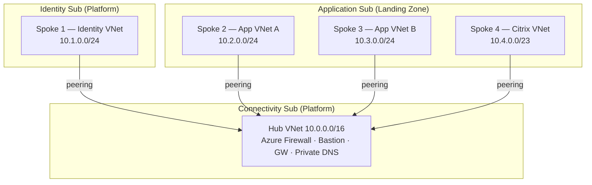

# Azure Landing Zone (ALZ) — Bicep Accelerator Deployment Runbook

**Audience:** Cloud Architects and Delivery Engineers
**Scope:** Repeatable deployment of the Azure Landing Zone platform using the **IaC Accelerator (Bicep)**, managed through **Azure DevOps**.
**Source of truth:** [Azure Landing Zones — IaC Accelerator](https://azure.github.io/Azure-Landing-Zones/accelerator/) and the [`alz-bicep-accelerator`](https://github.com/Azure/alz-bicep-accelerator) repository.

> This runbook is written to be executed end-to-end and then re-run for additional tenants/environments. Treat the "Configuration" sections as the parts you change per engagement; the "Process" sections stay constant.

---

## 1. What this runbook delivers

This procedure stands up the **platform landing zone** for the TRG tenant and the operating model to maintain it over time:

- A **management group hierarchy** rooted at an intermediate group (`TRG`) under Tenant Root, with **Platform** and **Landing Zone** branches.
- **Azure Policy** assignments aligned to Microsoft's prescriptive ALZ guidance.
- **Centralised logging** (Log Analytics, optional Sentinel/Change Tracking).
- **Hub networking** in the Connectivity subscription (hub VNet, Azure Firewall, gateways, Private DNS).
- **Spoke virtual networks** for Identity, two Application spokes, and a Citrix spoke — peered to the hub.
- An **Azure DevOps repo + CI/CD pipelines** that deploy and continuously maintain all of the above using GitOps.

> **Important architectural note.** The ALZ Bicep accelerator deploys the **platform** (management groups, policy, logging, and the connectivity hub). The **Identity, Application, and Citrix spoke VNets** live in their own subscriptions and are deployed as **separate spoke/landing-zone deployments** (subscription vending module or a small custom Bicep module) that peer back to the hub. Section 9 covers this. Keep platform and workload concerns in separate pipelines/stages so the platform can be updated independently.

---

## 2. Target architecture (TRG)

### 2.1 Management group + subscription layout

```
Tenant Root Group
└── TRG  (intermediate root management group)
    ├── Platform
    │   ├── Connectivity (subscription)   → Hub Virtual Network (+ Azure Firewall, gateways, Private DNS)
    │   ├── Identity      (subscription)  → Spoke 1: Identity VNet (DC / Entra DS)
    │   └── Management    (subscription)  → Log Analytics, Automation  [recommended, see §5.1]
    └── Landing Zone  (a.k.a. landingzones / "Application landing zones")
        └── Application   (subscription)
            ├── Spoke 2: App VNet A
            ├── Spoke 3: App VNet B
            └── Spoke 4: Citrix VNet
```

Mapping to ALZ defaults: the accelerator ships a default hierarchy of `int-root → platform, landingzones, sandbox, decommissioned`. In this design **`int-root` = `TRG`** and **`landingzones` = "Landing Zone"**. `sandbox` and `decommissioned` are optional but recommended to keep (low cost, useful guardrails). You may rename/trim them in Section 8.

### 2.2 Network topology (hub & spoke)



> Address spaces above are placeholders — replace with your IPAM allocation. The Citrix VNet is sized larger (`/23`) to allow for VDA pools, Cloud Connectors, and image-build subnets; adjust to your sizing.

### 2.3 Networking pattern decision

The accelerator offers two patterns via the `networkType` input:

| Pattern | `networkType` | Use when |
|---|---|---|
| **Hub & Spoke** (this design) | `hubNetworking` | You want a customer-managed hub VNet with Azure Firewall in the Connectivity sub. |
| Virtual WAN | `vwanConnectivity` | You want Microsoft-managed transit, global routing, many branches/regions. |
| None | `none` | Management groups, policy, and logging only (no connectivity). |

This runbook uses **`hubNetworking`**.

---

## 3. Tooling and repository strategy (Azure DevOps)

The accelerator **bootstraps** your Azure DevOps environment for you. After bootstrap you will have:

- An **Azure DevOps Project** (supplied or created by the bootstrap).
- A **Module repository** — holds the ALZ Bicep starter module + your parameter files (`.bicepparam`). This is what you edit.
- A **Pipeline-templates repository** — holds the reusable YAML pipeline definitions.
- A **Continuous Integration (CI)** pipeline — lint / build / what-if on pull requests.
- A **Continuous Delivery (CD)** pipeline — deploys to Azure on merge to `main`.
- **Environments** for `Plan` and `Apply`, with an **approval gate** before Apply.
- A **Variable Group** for backend/runtime values.
- **Service Connections** using **Workload Identity Federation (OIDC)** for Plan and Apply — no stored secrets.
- A **User-Assigned Managed Identity (UAMI)** in Azure with federated credentials, granted least-privilege rights on the management groups (and state, for Terraform-bootstrap only).

> **Bicep + the bootstrap.** For Bicep users the accelerator uses **Terraform only to *bootstrap*** the VCS/identity scaffolding. **Bicep is what deploys and updates the platform landing zone** through the pipelines. You do not write Terraform for the landing zone itself.

### 3.1 Repository model — upstream vs. your repo

There are **two distinct repositories**. Do not confuse them, and **do not deploy the upstream repo directly**.

| | Upstream: [`Azure/alz-bicep-accelerator`](https://github.com/Azure/alz-bicep-accelerator) | Your generated **module repo** (in Azure DevOps) |
|---|---|---|
| Owned by | Microsoft | You / TRG |
| Purpose | Source of the Bicep starter templates + AVM modules + example bootstrap inputs | The repo you edit, version, and deploy from |
| How it's used | The **ALZ PowerShell module** (`Deploy-Accelerator`) pulls starter content from a **pinned release** of this repo | Created by the bootstrap; seeded with the starter content; drives CI/CD |
| You edit it? | **No** (read-only reference; you may browse/clone to inspect) | **Yes** — `.bicepparam` files, pipeline config, spokes |
| Version control | `starter_module_version` / `bootstrap_module_version` select the release | Your branches, PRs, tags |

Flow:

```
Azure/alz-bicep-accelerator  ──(Deploy-Accelerator pins a release)──▶  Your ADO module repo  ──CI/CD──▶  Azure
   (Microsoft upstream)                                                  (you customize & deploy)
```

Practical implications:
- You **never** fork-and-deploy `alz-bicep-accelerator`. You consume it through the accelerator, which seeds **your** repo.
- **Pin** `starter_module_version` (and `bootstrap_module_version`) to an explicit release for production — don't float on "Latest" — so deployments are reproducible (see §11).
- **Upgrades** = bump the pinned version on a branch, regenerate/merge changes into your repo, review the `what-if`, and roll out via the normal PR → CD flow (see §10.3). This framework is the newer AVM-based Bicep path and is still maturing, so test upgrades before production.

---

## 4. Phase 0 — Planning (decisions to lock before you start)

Record these in your engagement workbook; they drive the config files.

| Decision | This deployment | Notes |
|---|---|---|
| IaC language | **Bicep** | |
| VCS | **Azure DevOps (hosted)** | Self-hosted ADO Server not supported by bootstrap; use `alz_local` then wire CI/CD yourself. |
| Intermediate root MG id / name | `TRG` | Becomes `int-root` equivalent. |
| Platform child MGs | Platform, (Connectivity/Identity/Management as subs under Platform) | |
| Landing Zone MG | "Landing Zone" (`landingzones`) | Hosts Application sub. |
| Subscriptions | Management, Connectivity, Identity, Application | See §5.1 for the 4-sub recommendation. |
| Network pattern | `hubNetworking` | |
| Regions | Primary (+ secondary if multi-region) | Accelerator defaults to **two** regions; trim to one if required (§8.4). |
| IP addressing | From IPAM | Hub + 4 spokes, non-overlapping with on-prem. |
| Agents | Microsoft-hosted or self-hosted | Microsoft-hosted needs a parallel job (§5.3). |

---

## 5. Phase 1 — Prerequisites

### 5.1 Azure subscriptions

Create the platform subscriptions under the billing account (EA/MCA) **before** bootstrap and record each subscription ID.

| Subscription | Required? | Purpose | MG placement |
|---|---|---|---|
| **Management** | Required | Bootstrap + Log Analytics, Automation | Platform |
| **Connectivity** | Required | Hub VNet, Azure Firewall, gateways, Private DNS | Platform |
| **Identity** | Recommended | DCs / Entra Domain Services, identity VNet | Platform |
| **Application** | (your workload) | App spokes + Citrix VNet | Landing Zone |
| Security | Recommended | Sentinel, security tooling | Platform |

> Microsoft strongly recommends the **4 platform subscriptions** (Management, Connectivity, Identity, Security). Moving resources between subscriptions later is painful and not supported for all resource types. The **Application** subscription is your first workload landing-zone subscription and sits under Landing Zone.

### 5.2 Azure permissions (run-once, by the engineer doing bootstrap)

| Permission | Where | Why |
|---|---|---|
| `Owner` | Parent MG (`TRG`) | Grants least-privilege rights to the deployment identities. |
| `Owner` | Each platform subscription | Deploy resources. |
| **`User Access Administrator`** | **Root `/` scope** | **Bicep-only** requirement to delegate access to the deployment identities (current ARM limitation). See the [Root Access](https://azure.github.io/Azure-Landing-Zones/accelerator/1_prerequisites/root-access/) guide to elevate. |

A **user account** is recommended for this one-off (simpler than a service principal).

### 5.3 Azure DevOps prerequisites

1. **Billing / parallel jobs.** A new ADO org has **no** Microsoft-hosted agents. Either [set up billing](https://learn.microsoft.com/azure/devops/organizations/billing/set-up-billing-for-your-organization-vs) and buy **at least one parallel job**, or request a [free parallel pipeline grant](https://learn.microsoft.com/azure/devops/pipelines/licensing/concurrent-jobs).
2. **Personal Access Token (`token-1`).** Used by the bootstrap to create projects/repos/pipelines. Create at `dev.azure.com → User settings → Personal access tokens → New Token`:
   - Name: `Azure Landing Zone Accelerator`
   - Expiration: **Custom defined → tomorrow** (short-lived; it's only needed during bootstrap).
   - Scopes (click *Show all scopes*): `Agent Pools` (Read & manage), `Build` (Read & execute), `Code` (Full), `Environment` (Read & manage), `Graph` (Read & manage), `Pipeline Resources` (Use & manage), `Project and Team` (Read, write & manage), `Service Connections` (Read, query & manage), `Variable Groups` (Read, create & manage).
   - Copy and store the token securely.
3. **`token-2` (self-hosted agents only).** A second PAT with only `Agent Pools: Read & manage`, longer expiry. Skip if using Microsoft-hosted agents.

### 5.4 Local workstation tooling

- PowerShell 7+ (`pwsh`)
- Azure CLI (`az`)
- Bicep CLI (`az bicep install`)
- Git
- VS Code (the wizard offers to open config files here)

---

## 6. Phase 2 — Bootstrap (creates the ADO environment)

> The bootstrap is run **once per platform** (per tenant/environment). This is **Approach A — recommended**. Approach B (manual ADO) is in Section 7.5.

### 6.1 Approach A — Accelerator bootstrap (recommended)

**Step 1 — Install/update the ALZ PowerShell module.**

```pwsh
$alzModule = Get-InstalledPSResource -Name ALZ 2>$null
if (-not $alzModule) { Install-PSResource -Name ALZ } else { Update-PSResource -Name ALZ }
```

**Step 2 — Authenticate to the Management subscription.**

```pwsh
az login                                   # browser + MFA
az account set --subscription "<management-subscription-id>"
az account show                            # confirm correct subscription
```

**Step 3 — Run the interactive wizard.**

```pwsh
Deploy-Accelerator
```

Provide, when prompted: IaC = **Bicep**, VCS = **Azure DevOps**, the ADO org/project, `token-1`, the four subscription IDs, parent MG = `TRG`, and `networkType` = `hubNetworking`. Set `bootstrap_module_version` and `starter_module_version` to **Latest** (or pin a release for reproducibility — see §11).

> The wizard writes the bootstrap config to `./config/inputs.yaml`. For non-interactive/repeatable runs you can pass a pre-filled inputs file (see the example in §13.1):
> ```pwsh
> Deploy-Accelerator -inputs ./config/inputs-azure-devops.yaml
> ```

**Step 4 — Update the platform landing zone config.** When the wizard offers to open VS Code, you **must** edit `./config/platform-landing-zone.yaml`:
- Set `starter_locations` — replace every `<region-#>` placeholder with valid Azure regions.
- Review networking/region settings.
Save the file.

> Do **not** continue until regions are populated — the bootstrap will not proceed without them.

**Step 5 — Approve the plan.** Type `yes` when prompted, review the generated plan, press Enter to deploy the bootstrap. This creates the ADO project, repos, pipelines, environments, variable group, service connections, and the Azure UAMI + role assignments.

**Step 6 — Clone the module repo and customise.**

```pwsh
git clone https://dev.azure.com/<org>/<project>/_git/<module-repo>
cd <module-repo>
```

Edit the `.bicepparam` files (Section 8), commit, and push. The push triggers CI; the merge to `main` triggers CD (Section 7).

> **Tighten the PAT.** Once bootstrap completes, you can revoke/expire `token-1` — it is no longer needed for ongoing GitOps.

### 6.2 What the bootstrap created (verify in ADO)

- Project + **module repo** + **pipeline-templates repo**
- Branch policy on `main` (PR required)
- **CI** and **CD** pipelines
- `Plan` and `Apply` environments (Apply has an approval gate + group)
- Variable Group (backend/runtime)
- Service Connections (Plan/Apply) with Workload Identity Federation
- In Azure: Identity resource group + UAMI + federated credentials + MG role assignments

---

## 7. Phase 3 — Run (deploy and operate via CI/CD)

### 7.1 The GitOps loop

```
edit .bicepparam → branch → push → PR (CI: build + what-if) → review/approve → merge to main → CD (Apply gate → deploy)
```

### 7.2 Deploy order

The accelerator's CD pipeline deploys management-group templates independently, each referencing its parent MG id. Effective order:

1. **Management groups + policy** (`Core/Governance/mgmt-groups`) — `int-root`(=TRG) → platform → landingzones → sandbox → decommissioned.
2. **Logging** (`Core/Logging`) — into Management subscription.
3. **Connectivity / Hub** (`Networking/HubNetworking`) — into Connectivity subscription.

Spokes (Identity, App A/B, Citrix) are deployed afterward (Section 9).

### 7.3 First deployment

Make your Section 8 edits on a branch, open a PR, let CI run `what-if`, review the plan, approve, and merge. CD runs, pauses at the **Apply** approval gate, then deploys.

### 7.4 Validate

- Management groups exist under `TRG` and subscriptions are in the right groups.
- Policy assignments present at `TRG`/Platform/Landing Zone.
- Log Analytics workspace deployed in Management sub.
- Hub VNet + Azure Firewall + Private DNS deployed in Connectivity sub.
- `az deployment mg list` / Azure Portal → Deployments show success.

### 7.5 Approach B — Manual Azure DevOps pipelines (alternative / comparison)

Use when you need full control, can't run the bootstrap (e.g. self-hosted ADO Server, strict change control), or want to fold ALZ into an existing repo. You replicate by hand what the bootstrap automates.

1. **Repo.** Create/choose an ADO Git repo. Add the Bicep starter from [`alz-bicep-accelerator/templates`](https://github.com/Azure/alz-bicep-accelerator/tree/main/templates) (`Core/Governance/mgmt-groups`, `Core/Logging`, `Networking/HubNetworking`) plus their `.bicepparam` files.
2. **Service connection (OIDC).** Create a UAMI (or app registration), add federated credentials for ADO, and create an **Azure Resource Manager service connection** using **Workload Identity Federation**. Grant the identity `Owner`/`Contributor` + `User Access Administrator` (or `Role Based Access Control Administrator`) at the `TRG` MG scope.
3. **CI pipeline (`azure-pipelines-ci.yml`).** On PR: `az bicep build`, `az bicep lint`, and `az deployment mg what-if` per template.
4. **CD pipeline (`azure-pipelines-cd.yml`).** On merge to `main`: `az deployment mg create` per template in the order in §7.2, with a manual-approval **Environment** gate before the apply stage.
5. **Branch policy.** Require PR + successful CI build + reviewer approval on `main`.
6. **Variable group / library.** Store tenant id, MG ids, subscription ids, location.

Reference deploy commands:

```bash
# Management groups + policy (tenant/MG scope)
az deployment mg create \
  --name alz-mgmtgroups-$(date +%Y%m%d%H%M) \
  --management-group-id TRG \
  --location <region> \
  --template-file templates/core/governance/mgmt-groups/main.bicep \
  --parameters templates/core/governance/mgmt-groups/main.bicepparam

# Logging (subscription scope - Management sub)
az deployment sub create \
  --name alz-logging-$(date +%Y%m%d%H%M) \
  --location <region> \
  --template-file templates/core/logging/main.bicep \
  --parameters templates/core/logging/main.bicepparam

# Hub networking (subscription scope - Connectivity sub)
az deployment sub create \
  --name alz-hub-$(date +%Y%m%d%H%M) \
  --location <region> \
  --template-file templates/networking/hubnetworking/main.bicep \
  --parameters templates/networking/hubnetworking/main.bicepparam
```

### 7.6 Approach comparison

| | A — Accelerator bootstrap (recommended) | B — Manual ADO pipelines |
|---|---|---|
| Setup effort | Low (wizard) | High (build everything) |
| ADO repos/pipelines/SC | Auto-created | Hand-built |
| OIDC identity + MG RBAC | Auto-configured | You configure |
| Consistency / repeatability | High (re-run wizard) | Depends on your discipline |
| Control over structure | Opinionated | Total |
| Best for | New ALZ on hosted ADO | Self-hosted ADO, existing repos, strict change control |
| Updates/upgrades | Documented upgrade path | You own the upgrade logic |

> Recommendation: use **A** to establish the baseline, then customise the generated repo. Fall back to **B** only where a constraint blocks the bootstrap.

---

## 8. Configuration — mapping the TRG design to the Bicep parameters

After bootstrap, edit these in the **module repo**. Each module folder has its own `main.bicep` + `main.bicepparam`.

### 8.1 Management group hierarchy (`Core/Governance/mgmt-groups`)

- Set the intermediate root id/name to **`TRG`** (this is the `int-root` equivalent).
- Confirm children: **Platform** and **Landing Zone** (`landingzones`); keep/trim `sandbox`, `decommissioned`.
- Each MG folder has its own `main.bicep`/`main.bicepparam` and references its **parent MG id** — make sure Platform and Landing Zone point at `TRG`.
- Subscription IDs are **pre-populated** by the bootstrap from your YAML. Verify Connectivity, Identity, Management land under **Platform**, and Application lands under **Landing Zone**.
- To rename/restructure beyond defaults, follow [Modifying the Management Group Hierarchy (Bicep)](https://azure.github.io/Azure-Landing-Zones/bicep/howtos/modifyingmghierarchy/).

### 8.2 Logging (`Core/Logging`)

- Set `parLocations` to your region(s).
- Configure retention, optional Sentinel, Change Tracking, Automation Account.

### 8.3 Hub networking (`Networking/HubNetworking`)

Example `main.bicepparam` (single-region hub for the Connectivity sub):

```bicep
param parLocations = ['<region>']

param hubNetworks = [
  {
    name: 'vnet-hub-trg-<region>'
    location: parLocations[0]
    addressPrefixes: ['10.0.0.0/16']
    azureFirewallSettings: {
      deployAzureFirewall: true
      azureFirewallName: 'afw-trg-<region>'
      azureSkuTier: 'Standard'
    }
    vpnGatewaySettings: {
      deployVpnGateway: true
      name: 'vgw-trg-<region>'
      skuName: 'VpnGw2AZ'
    }
    expressRouteGatewaySettings: {
      deployExpressRouteGateway: false   // enable if using ExpressRoute
    }
  }
]
```

Key points:
- **Address prefixes** must align with IPAM and not overlap on-prem or spokes.
- Toggle optional services with the `deploy*` flags (Firewall, Bastion, VPN/ER gateways, DDoS, DNS Private Resolver).
- Zones are auto-selected via `pickZones()`; override with `zones: [...]`/`publicIpZones: [...]` if needed.
- **DDoS policy gotcha:** if you have no DDoS plan, the networking module does **not** disable the DDoS *policy assignment* — disable/modify it separately in the MG config ([how-to](https://azure.github.io/Azure-Landing-Zones/bicep/howtos/modifyingpolicyassignments/#ddos-protection)).

### 8.4 Single vs. multi-region

The accelerator defaults to **two** regions. For single-region: remove the secondary region from all `parLocations` arrays, delete the second hub object, set `deployPeering` to `false`, and remove the `peeringSettings` block. For different regions, just replace the region names.

---

## 9. Spoke VNets (Identity, App A, App B, Citrix)

The platform accelerator deploys the **hub**. The four spokes are deployed separately and peered to the hub. Two supported routes:

### 9.1 Option 1 — Subscription vending (recommended for repeatability)

Use the AVM **subscription vending** pattern ([`avm/ptn/lz/sub-vending`](https://github.com/Azure/bicep-registry-modules/tree/main/avm/ptn/lz/sub-vending)). It can create/associate the subscription, place it under the correct MG, deploy the spoke VNet, and **establish hub peering** in one module. Run one vend per spoke:

| Spoke | Subscription | MG | VNet (example) | Peer to hub |
|---|---|---|---|---|
| Spoke 1 — Identity | Identity | Platform | `10.1.0.0/24` | Yes |
| Spoke 2 — App A | Application | Landing Zone | `10.2.0.0/24` | Yes |
| Spoke 3 — App B | Application | Landing Zone | `10.3.0.0/24` | Yes |
| Spoke 4 — Citrix | Application | Landing Zone | `10.4.0.0/23` | Yes |

> The Identity VNet sits in the **Identity** subscription under **Platform**. App A, App B, and Citrix VNets all sit in the **Application** subscription under **Landing Zone** (multiple VNets in one subscription is fine).

### 9.2 Option 2 — Custom spoke Bicep module

If you don't use vending, deploy a small spoke module per VNet (`Microsoft.Network/virtualNetworks` + `virtualNetworkPeerings` to the hub, plus a UDR sending `0.0.0.0/0` to the Azure Firewall private IP). Add these as additional stages in the CD pipeline so they deploy after the hub.

### 9.3 Citrix considerations

- Size the Citrix VNet for VDA pools, Cloud Connectors, and image-build subnets (hence `/23`).
- Force-tunnel egress through the hub firewall (UDR → AzFW) and allow the [Citrix Cloud connectivity FQDNs/ports](https://learn.microsoft.com/azure/cloud-adoption-framework/scenarios/azure-virtual-desktop/landing-zone-citrix/citrix-enterprise-scale-landing-zone) in firewall policy.
- Private DNS resolution flows via the hub's Private DNS zones / DNS Private Resolver.

---

## 10. Azure DevOps operating model (maintaining updates)

This is how the platform is kept current after go-live — the "repeatable updates" requirement.

### 10.1 Change workflow (every change)

1. Create a **work item** (Boards) describing the change (e.g. "Add Citrix spoke peering", "Bump ALZ library to vX").
2. Branch from `main` (`feature/<workitem-id>-<slug>`), link the branch/PR to the work item.
3. Edit `.bicepparam` / templates; commit.
4. Open a **Pull Request** → **CI** runs build + `what-if`. Reviewers inspect the what-if diff.
5. Approve PR (branch policy enforces review + green CI).
6. Merge to `main` → **CD** runs, pauses at the **Apply** approval gate, then deploys.
7. Work item auto-closes on merge (link via `Fixes #id`).

### 10.2 Recommended ADO governance

- **Branch policy** on `main`: require PR, ≥1 reviewer, successful CI build, linked work item, no direct pushes.
- **Environments + approvals:** keep the `Apply` environment gate; add a second approver for production.
- **Pipeline as code:** keep CI/CD YAML in the pipeline-templates repo; version it.
- **Variable group / Library:** store MG ids, subscription ids, regions; mark secrets as secret (though OIDC means few secrets).
- **Tags/releases:** tag the repo on each successful platform deployment for traceability.
- **Dashboards & notifications:** a Boards dashboard for ALZ changes; pipeline notifications to Teams/email.

### 10.3 Updating the ALZ library and module versions

- **ALZ library (policies/archetypes):** follow [Updating the ALZ Library Version (Bicep)](https://azure.github.io/Azure-Landing-Zones/bicep/howtos/modifyingpolicyassets/).
- **Deployment updates generally:** follow [Updating Your Deployment (Bicep)](https://azure.github.io/Azure-Landing-Zones/bicep/howtos/update/).
- **Policy assignments:** [Modifying Policy Assignments](https://azure.github.io/Azure-Landing-Zones/bicep/howtos/modifyingpolicyassignments/).
- Do version bumps on a branch, review the `what-if`, and roll out via the normal PR → CD flow. Pin versions (don't float on "Latest") for production reproducibility.

---

## 11. Repeatability (re-running for another tenant/environment)

To make this a repeatable engagement:

1. **Pin versions.** Set `bootstrap_module_version` and `starter_module_version` to explicit releases (not "Latest") so re-runs are deterministic.
2. **Template the inputs.** Keep a parameterised `inputs-azure-devops.yaml` and `platform-landing-zone.yaml` per environment (dev/test/prod or per tenant) in source control. Run `Deploy-Accelerator -inputs <file>` non-interactively.
3. **Standardise naming/IPAM.** Maintain a naming convention + IPAM allocation sheet; feed values into the param files.
4. **Document deltas.** Capture per-tenant differences (region, subscription ids, address space) in an engagement workbook.
5. **One repo per platform.** Each tenant/platform gets its own module repo + pipelines; reuse the pipeline-templates as a shared, versioned template.
6. **Validate from a checklist** (Section 12) every run.

---

## 12. Validation & verification checklist

- [ ] `TRG` MG exists under Tenant Root; Platform and Landing Zone are children of `TRG`.
- [ ] Connectivity, Identity, Management subscriptions under **Platform**; Application under **Landing Zone**.
- [ ] Policy assignments present and compliant (check Policy → Compliance).
- [ ] Log Analytics workspace deployed (Management sub); Sentinel/Change Tracking if selected.
- [ ] Hub VNet + Azure Firewall + Private DNS + gateways deployed (Connectivity sub).
- [ ] Identity VNet (Spoke 1) deployed and peered to hub; peering `Connected`.
- [ ] App A, App B, Citrix VNets deployed (Application sub) and peered to hub.
- [ ] UDRs route spoke egress through Azure Firewall.
- [ ] CI runs build + what-if on PRs; CD requires approval before Apply.
- [ ] Branch policy on `main` enforced; `token-1` revoked/expired post-bootstrap.
- [ ] `az deployment mg list` / `az deployment sub list` show successful deployments.
- [ ] Citrix FQDNs/ports allowed in firewall policy; DNS resolution validated.

---

## 13. Appendix

### 13.1 Example files (from the repo)

- Bootstrap inputs — Azure DevOps: `https://raw.githubusercontent.com/Azure/alz-bicep-accelerator/refs/heads/main/examples/bootstrap/inputs-azure-devops.yaml`
- Bootstrap inputs — local: `https://raw.githubusercontent.com/Azure/alz-bicep-accelerator/refs/heads/main/examples/bootstrap/inputs-local.yaml`
- Starter templates: `https://github.com/Azure/alz-bicep-accelerator/tree/main/templates`

### 13.2 Modules deployed by the accelerator

- `Core/Governance/mgmt-groups` — MG hierarchy + policy (per-MG `main.bicep`/`main.bicepparam`, policy JSON in `lib/alz`).
- `Core/Logging` — Log Analytics, optional Sentinel, Change Tracking, Automation, AMA DCRs.
- `Networking/HubNetworking` — hub VNet, Azure Firewall, Bastion, VPN/ER gateways, Private DNS, optional DDoS / DNS Private Resolver.
- `Networking/VirtualWAN` — alternative vWAN pattern (not used here).

### 13.3 Handy commands

```pwsh
# Re-run bootstrap non-interactively
Deploy-Accelerator -inputs ./config/inputs-azure-devops.yaml

# Validate a Bicep template locally
az bicep build --file templates/networking/hubnetworking/main.bicep
az deployment sub what-if --location <region> \
  --template-file templates/networking/hubnetworking/main.bicep \
  --parameters templates/networking/hubnetworking/main.bicepparam

# List management groups
az account management-group list -o table
```

### 13.4 Reference links

- IaC Accelerator: https://azure.github.io/Azure-Landing-Zones/accelerator/
- Phase 1 – Platform subscriptions & permissions: https://azure.github.io/Azure-Landing-Zones/accelerator/1_prerequisites/platform-subscriptions/
- Phase 1 – Azure DevOps: https://azure.github.io/Azure-Landing-Zones/accelerator/1_prerequisites/azuredevops/
- Phase 2 – Bootstrap: https://azure.github.io/Azure-Landing-Zones/accelerator/2_bootstrap/
- Phase 3 – Run: https://azure.github.io/Azure-Landing-Zones/accelerator/3_run/
- Bicep starter module: https://azure.github.io/Azure-Landing-Zones/accelerator/starter-bicep/
- Bicep getting started / customisation: https://azure.github.io/Azure-Landing-Zones/bicep/gettingstarted/
- Modifying the MG hierarchy (Bicep): https://azure.github.io/Azure-Landing-Zones/bicep/howtos/modifyingmghierarchy/
- Updating your deployment (Bicep): https://azure.github.io/Azure-Landing-Zones/bicep/howtos/update/
- Subscription vending (AVM): https://github.com/Azure/bicep-registry-modules/tree/main/avm/ptn/lz/sub-vending
- Citrix on Azure ALZ: https://learn.microsoft.com/azure/cloud-adoption-framework/scenarios/azure-virtual-desktop/landing-zone-citrix/citrix-enterprise-scale-landing-zone
- `alz-bicep-accelerator` repo: https://github.com/Azure/alz-bicep-accelerator

---
*Prepared as a repeatable delivery runbook. Pin module/library versions for production and drive all changes through the Azure DevOps PR → CI (what-if) → approval → CD flow.*
